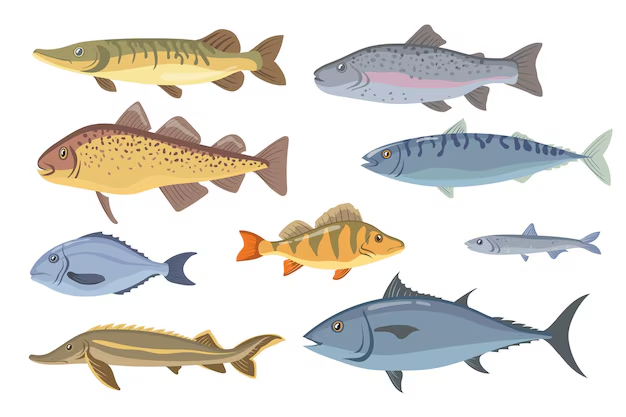

Estimate the weight of a fish based on its species and the physical measurements

### **Objective:** The fish market dataset is a collection of data related to various species of fish and their characteristics. This dataset is designed for polynomial regression analysis and contains several columns with specific information.

### **1. Setting up R Packages**

```{r}
#| message: false
#| warning: false

library(readr)
library(tidyverse)
library(dplyr)
library(ggformula)
library(janitor)
library(naniar)
library(visdat)
```

### **2. Reading Data**

```{r}
fish <- readr::read_csv("../../data/Fish.csv", show_col_types = FALSE)
```

### **3. Examining and Cleaning Data**

```{r}
dim(fish)
str(fish)
```

```{r}
head(fish)
tail(fish)
```

```{r}
names(fish)
```

```{r}
visdat::vis_dat(fish, sort_type = TRUE)
```

```{r}
fish_modified <- fish %>% tidyr::drop_na()
visdat::vis_dat(fish_modified, sort_type = TRUE)
```

```{r}
fish_modified <- fish %>%
  dplyr::mutate(across(where(is.character), as.factor)) %>% 
  relocate(where(is.factor))
glimpse(fish_modified)
```

```{r}
fish_modified %>%
  DT::datatable(
    style = "default",
    caption = htmltools::tags$caption(
      style = "caption-side: top; text-align: left; color: black; font-size: 100%;", "Fish Market Dataset (Clean)"
    ),
    options = list(pageLength = 10, autoWidth = TRUE)
  ) %>%
  DT::formatStyle(
    columns = names(fish_modified),
    fontFamily = "Arial",
    fontSize = "12px",
  )
```

### **4. Data Dictionary**

**Quantitative Data**

1.  Weight (dbl): The weight of the fish (in grams).
2.  Length1 (dbl): The first measurement of the fish's length (in cm).
3.  Length2 (dbl): The second measurement of the fish's length (in cm).
4.  Length3 (dbl): The third measurement of the fish's length (in cm).
5.  Height (dbl): The height of the fish (in cm).
6.  Width (dbl): The width of the fish (in cm).

**Qualitative Data**

1.  Species (fct): The species name of the fish (e.g., Perch, Bream, Roach, Pike, Smelt, Parkki, or Whitefish).

```{r}
summary(fish)
```

### **5. Graphs**

```{r}
fish_modified %>%
  gf_histogram(~ Weight,
               fill = "cyan4",
               bins = 20) %>%
  gf_labs(title = "Weight",
          x = "Weight (grams)",
          y = "Number of Fish")

fish_avg_length <- fish_modified %>%
  mutate(Average_Length = rowMeans(select(., Length1, Length2, Length3)))
fish_avg_length %>%
  gf_histogram(~ Average_Length,
               fill = "steelblue",
               bins = 20) %>%
  gf_labs(title = "Average Fish Length",
          x = "Average Length (cm)",
          y = "Number of Fish")

fish_modified %>%
  gf_histogram(~ Height,
               fill = "pink",
               bins = 20) %>%
  gf_labs(title = "Height",
          x = "Height (cm)",
          y = "Number of Fish")

fish_modified %>%
  gf_histogram(~ Width,
               fill = "palevioletred",
               bins = 20) %>%
  gf_labs(title = "Width",
          x = "Width (cm)",
          y = "Number of Fish")

```

```{r}
fish_avg_length %>%
gf_point(Average_Length ~ Weight, data = fish_avg_length, color = 'lightgreen', size = 2) %>%
  gf_smooth(color = 'black') %>% 
  gf_labs(title = "Average Length vs Weight",
          x = "Weight (grams)",
          y = "Average Length (cm)")

fish_avg_length %>%
gf_point(Width ~ Weight, data = fish_avg_length, color = 'navy', size = 2) %>%
  gf_smooth(color = 'black') %>% 
  gf_labs(title = "Width vs Weight",
          x = "Width (cm)",
          y = "Average Length (cm)")

fish_avg_length %>%
gf_point(Height ~ Weight, data = fish_avg_length, color = 'darkgreen', size = 2) %>%
  gf_smooth(color = 'black') %>% 
  gf_labs(title = "Height vs Weight",
          x = "Width (cm)",
          y = "Height (cm)")
```

```{r}
fish_lm <- lm(Weight ~ Average_Length +
                Height +
                Width,
                data = fish_avg_length)
summary(fish_lm)

```

```{r}
# This is where I realised this was multiple linear regression

# fish_avg_length %>%
#   gf_point(Weight ~ Average_Length +
#                 Height +
#                 Width, color = 'hotpink') %>%
#   gf_lm(color = "black")%>%
#   gf_labs(title = "Weight vs (Average Length, Height, Width)",
#           x = "Model",
#           y = "Weight (grams)")
```

### **6. Predicting Model**

```{r}
test = data.frame(Average_Length = 30,
                  Height = 15,
                  Width = 5.5)

predict(fish_lm, newdata = test)
```
### **7. Prediction using train and test data**

```{r}
rows <- nrow(fish_avg_length)
rows
0.75 * rows
```

```{r}
train_rows <- sample(1:nrow(fish_avg_length), 120)
```

```{r}
train_data = fish_avg_length[train_rows, ]
```

```{r}
test_data = fish_avg_length[-train_rows, ]
```

```{r}
table(test_data$Species)
```

```{r}
table(fish_avg_length$Species)
```

```{r}
prop.table(table(fish_avg_length$Species))
```

1.  average length, height, width -\> weight

```{r}

avgl_h_w_lm <- lm(Weight ~ Average_Length + Height + Width,
                  data = train_data)
summary(avgl_h_w_lm)
```

```{r}
predicted_values1 <- predict(avgl_h_w_lm, newdata = test_data)
```

```{r}
plot(predicted_values1, test_data$Weight,
     xlab = "Predicted Weight (gm)", 
     ylab = "Actual Weight (gm)", 
     main = "Fish Weight: Predicted vs. Actual")
abline(a = 0, b = 1, col = "palevioletred", lwd = 2)
```

2.  average length -\> weight

```{r}
avgl_lm <- lm(Weight ~ Average_Length,
              data = train_data)
summary(avgl_lm)
```

```{r}
predicted_values2 <- predict(avgl_lm, newdata = test_data)
```

```{r}
plot(predicted_values2, test_data$Weight,
     xlab = "Predicted Weight (gm)", 
     ylab = "Actual Weight (gm)", 
     main = "Fish Weight: Predicted vs. Actual")
abline(a = 0, b = 1, col = "violet", lwd = 2)
```

3.  width -\> weight

```{r}
w_lm <- lm(Weight ~ Width,
              data = train_data)
summary(w_lm)
```

```{r}
predicted_values3 <- predict(w_lm, newdata = test_data)
```

```{r}
plot(predicted_values3, test_data$Weight,
     xlab = "Predicted Weight (gm)", 
     ylab = "Actual Weight (gm)", 
     main = "Fish Weight: Predicted vs. Actual")
abline(a = 0, b = 1, col = "navy", lwd = 2)
```

4.  height -\> weight

```{r}
h_lm <- lm(Weight ~ Height,
              data = train_data)
summary(h_lm)
```

```{r}
predicted_values4 <- predict(h_lm, newdata = test_data)
```

```{r}
plot(predicted_values4, test_data$Weight,
     xlab = "Predicted Weight (gm)", 
     ylab = "Actual Weight (gm)", 
     main = "Fish Weight: Predicted vs. Actual")
abline(a = 0, b = 1, col = "pink", lwd = 2)
```

Finding RMSE for each linear model

```{r}
sqrt(mean((predicted_values1-test_data$Weight)^2))
sqrt(mean((predicted_values2-test_data$Weight)^2))
sqrt(mean((predicted_values3-test_data$Weight)^2))
sqrt(mean((predicted_values4-test_data$Weight)^2))
```

Therefore, we can conclude that the second model \[ average length -\> weight \] is the most successful linear model because it has the lowest RMSE.

### **8. Clustering**

```{r}
names(fish_avg_length)
```
```{r}
cols_for_clustering <- c("Weight", "Height", "Width", "Average_Length")
df <- fish_avg_length[, cols_for_clustering]
fish_scaled <- scale(df)
```

```{r}
kmeans(fish_scaled, 2, nstart = 30)
```

```{r}
wss <- function(k) {
  set.seed(1105)
  kmeans(fish_scaled, k, nstart = 30)$tot.withinss
}
```

```{r}
k_values <- 1:15
```

```{r}
wss_values <- map_dbl(k_values, wss)
```

```{r}
plot(k_values, wss_values,
     type="b", pch = 19, frame = FALSE, 
     xlab="Number of clusters K",
     ylab="Total within-clusters sum of squares")
```

```{r}
dim(fish_scaled)
```

```{r}
set.seed(1105)

final <- kmeans(fish_scaled, 6, iter.max = 10, nstart = 30)
final
```

```{r}
final$size
```

```{r}
final$cluster
final
```

```{r}
names(df)
```

```{r}
df$Species <- fish_avg_length$Species
df$Cluster <- final$cluster
```

```{r}
table(df$Cluster)
```

```{r}
names(df)
```

```{r}
df <- select(df, Cluster, Species, Height, Weight, Width, Average_Length)
aggregate(. ~ Cluster, df[, c(1,3,4,5,6)], function(x) round(mean(x)))
```

### **9. Summary**

This dataset contains three recordings of the length of each fish. I used the average of these lengths for the graphs. I checked the correlation of \[average length vs weight\], \[width vs weight\], and \[height vs weight\] and I found that there was no linear relation between any of them. However, I created a linear regression model of \[weight vs (average length, height and width)\] and the summary shows that it is very significant. The adjusted R\^2 value is closer to 1, thus proves that this linear regression model is successful. However, I was not able to plot the graph. On learning what the error was, I came to know that this was a multiple linear regression model and the syntax for the graph was incorrect.
