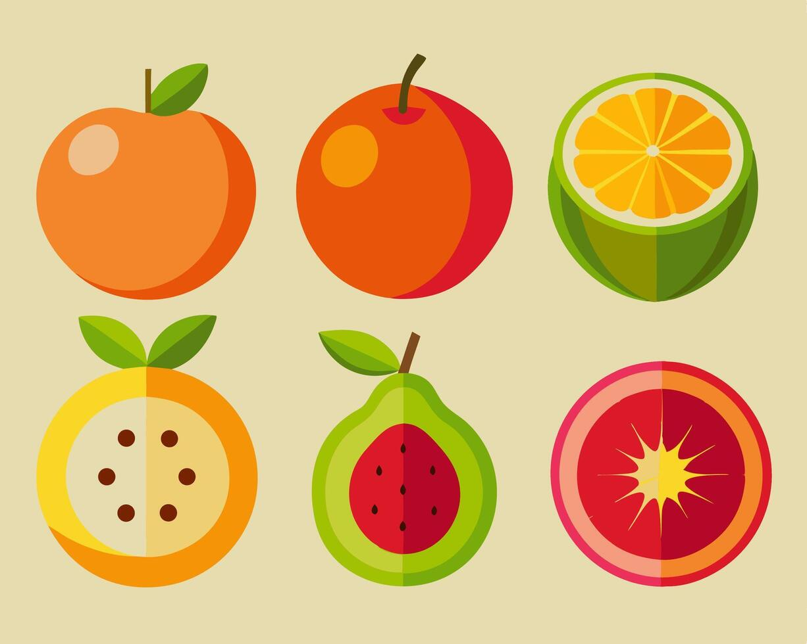

This model accepts data and predicts if the fruit is an orange or a guava

### **Objective:** The aim of this model is to accept variables from the user such as pole to pole measurement, circumference, weight etc of a fruit and predict whether it is an orange or a guava using logistic regression.

### **1. Setting up R Packages**

```{r}
#| message: false
#| warning: false

library(readr)
library(tidyverse)
library(dplyr)
library(ggformula)
library(janitor)
library(naniar)
library(visdat)
library(rsample)
```

### **2. Reading Data**

```{r}
fruit <- readr::read_csv("../../data/oranges_or_guavas.csv", show_col_types = FALSE)
```

###  **3. Examining and Cleaning Data**

```{r}
dim(fruit)
str(fruit)
```

```{r}
head(fruit)
tail(fruit)
```

```{r}
names(fruit)
```

```{r}
visdat::vis_dat(fruit, sort_type = TRUE)
```

```{r}
fruit_modified <- fruit %>% tidyr::drop_na()
visdat::vis_dat(fruit_modified, sort_type = TRUE)
```

```{r}
fruit_modified <- fruit %>%
  dplyr::mutate(across(where(is.character), as.factor)) %>% 
  relocate(where(is.factor))
glimpse(fruit_modified)
```

```{r}
fruit_modified %>%
  DT::datatable(
    style = "default",
    caption = htmltools::tags$caption(
      style = "caption-side: top; text-align: left; color: black; font-size: 100%;", "Orange or Guava Dataset (Clean)"
    ),
    options = list(pageLength = 10, autoWidth = TRUE)
  ) %>%
  DT::formatStyle(
    columns = names(fruit_modified),
    fontFamily = "Arial",
    fontSize = "12px",
  )
```
### **4. Data Dictionary**

**Quantitative Data**

1.  id (int): A unique identification number assigned to each fruit in the dataset.
2.  pole_to_pole_in_cm (dbl): The measurement of the fruit from top to top, measured in centimeters.
3.  circumference_in_cm (dbl): The measurement around the widest part of the fruit, measured in centimeters.
4.  weight_in_gm (dbl): The total mass of the fruit, measured in grams.

**Qualitative Data**

1.  fruit (fct): The type or category of the fruit (orange or guava).
2.  is_orange (int/fct): A binary indicator (1- orange, 0- guava).

```{r}
summary(fruit_modified)
```
###  **5. Graphs**

```{r}
gf_bar(~ fruit, data = fruit_modified, fill = ~ fruit) %>%
  gf_refine(scale_fill_brewer(palette = "Set2")) %>%
  gf_labs(title = "Frequency of Fruit Types",
          x = "Fruit",
          y = "Count")
```

```{r}
fruit_modified %>%
  gf_histogram(~ pole_to_pole_in_cm | fruit,
               bins = 20,
               fill = ~ fruit) %>%
  gf_refine(scale_fill_brewer(palette = "Set2")) %>%
  gf_labs(title = "Pole to Pole",
          x = "Length (cm)",
          y = "Number of Fruits")

fruit_modified %>%
  gf_histogram(~ circumference_in_cm | fruit,
               bins = 20,
               fill = ~ fruit) %>%
  gf_refine(scale_fill_brewer(palette = "Set2")) %>%
  gf_labs(title = "Circumference",
          x = "Length (cm)",
          y = "Number of Fruits")

fruit_modified %>%
  gf_histogram(~ weight_in_gm | fruit,
               bins = 20,
               fill = ~ fruit) %>%
  gf_refine(scale_fill_brewer(palette = "Set2")) %>%
  gf_labs(title = "Weight",
          x = "Weight (gm)",
          y = "Number of Fruits")
```

### **6. Logistic Regression**

```{r}
fruit_modified$fruit <- as.factor(fruit_modified$fruit)
```

```{r}
levels(fruit_modified$fruit)
```
prop- proportion - 70% training, 30% testing strata- fruit- to make sure the training and testing sets have a balanced mix of guavas and oranges

```{r}
set.seed(1013)
split <- initial_split(fruit_modified, prop = 0.7, strata = "fruit")
train_data <- training(split)
test_data <- testing(split)
```

```{r}
fruit_glm <- glm(fruit ~ pole_to_pole_in_cm + circumference_in_cm +
                    weight_in_gm,
                  data = train_data,
                  family = binomial)

summary(fruit_glm)
```

type = "response": This tells R to give you the probabilities (numbers between 0 and 1) that a fruit is an "orange" rather than just a "yes/no" answer

hist- The histogram shows you how "confident" the model is. If most values are near 0 or 1, the model is very certain; if they are all near 0.5, it's guessing.

```{r}
pred_prob1 <- predict(fruit_glm, newdata = test_data, type = "response")
pred_prob1
hist(pred_prob1)
plot(pred_prob1, test_data$fruit)
```

manually deciding that if the probability is greater than 50%, you'll label it an "orange." otherwise, it stays as the default "guava."

why 33- guavas- 28, oranges- 80 total- 108 30% testing- 30% of 108 = 33

first it declares that all 33 of these test fruits are guavas, then it actually checks line by line, if the probability is higher than 0.5 (50%), then it changes it to orange

```{r}
nrow(test_data)
pred_class1 <- rep("guava",33)
pred_class1[pred_prob1 > 0.5] <- "orange"
```
```{r}
table(Actual = test_data$fruit, Predicted = pred_class1)

summary(fruit_glm)
```
###  **7. Predicting Model**

```{r}
unknown_fruit <- data.frame(
  pole_to_pole_in_cm = 25.2, 
  circumference_in_cm = 18.5, 
  weight_in_gm = 150
)

prob_pred2 <- predict(fruit_glm, newdata = unknown_fruit, type = "response")
prob_pred2
```

Thus, we can conclude that the unknown fruit was a guava


### **8. Summary**


